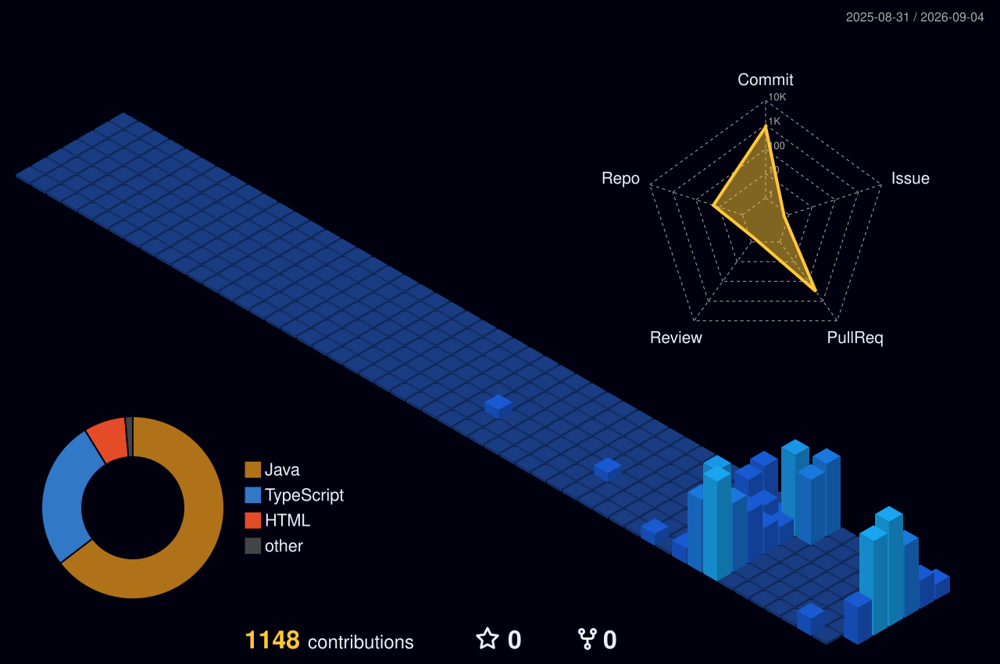

<!-- ╔══════════════════════════════════════════════════════════════╗
     ║   ADOLFO BERROCAL · GitHub Profile · palette blue → purple   ║
     ╚══════════════════════════════════════════════════════════════╝ -->

<div align="center">


<a href="https://github.com/manuel15963">

</a>

<br><br>


</div>

<br>

<!-- ═══════════════════════════ ABOUT ═══════════════════════════ -->

<h2 align="center">⚡ Developer Profile</h2>

<table align="center" width="100%">
<tr>
<td width="50%" valign="top">
<h3 align="center">👨‍💻 Backend Engineering</h3>
<p align="center">
☕ <b>Java Backend Developer</b><br><br>
🍃 Spring Boot &amp; REST APIs<br><br>
🧩 Microservices Architecture<br><br>
🔐 JWT Auth · RBAC · Multi-tenant SaaS<br><br>
🧠 Clean Code &amp; Maintainability
</p>
</td>
<td width="50%" valign="top">
<h3 align="center">🚀 Current Focus</h3>
<p align="center">
☁️ Google Cloud Run &amp; Microsoft Azure<br><br>
🐳 Docker &amp; Containers<br><br>
🔄 CI/CD with GitHub Actions<br><br>
🗄️ PostgreSQL · MySQL · Supabase<br><br>
📱 Angular &amp; Ionic front-ends
</p>
</td>
</tr>
</table>

<br>

<!-- ═══════════════════════════ FLAGSHIP ═══════════════════════════ -->

<h2 align="center">🏆 Flagship Project · VENDINGCOM</h2>

<p align="center">
<b>Multi-tenant SaaS for vending-machine businesses</b><br>
12 Spring Boot microservices · Angular + Ionic app · Google Cloud Run · Supabase (PostgreSQL)
</p>

<p align="center">


</p>

<p align="center">
Auth · Customers · Locations · Machines · Inventory · Routes &amp; Visits · Collections · Reports · Tickets · Supply · Purchases · Expenses
</p>

<br>

<!-- ═══════════════════════════ ARSENAL ═══════════════════════════ -->

<h2 align="center">⚙️ Technology Arsenal</h2>

<div align="center">

<h3>💻 Languages</h3>


<br><br>

<h3>🔥 Backend &amp; Frontend</h3>


<br><br>

<h3>☁️ Cloud &amp; DevOps</h3>


<br><br>

<h3>🗄️ Databases</h3>

<br>


<br><br>

<h3>🛠️ Tools</h3>


</div>

<br>

<!-- ═══════════════════════════ STATS ═══════════════════════════ -->

<h2 align="center">📊 GitHub Stats</h2>

<div align="center">


<br><br>


</div>

<br>

<!-- ═══════════════════════════ METRICS ═══════════════════════════ -->

<h2 align="center">📡 Developer Command Center</h2>

<p align="center">

</p>

<br>

<!-- ═══════════════════════════ SNAKE ═══════════════════════════ -->

<h2 align="center">🐍 Contribution Snake</h2>

<p align="center">
<picture>
<source media="(prefers-color-scheme: dark)" srcset="./assets/github-snake-dark.svg"/>
<source media="(prefers-color-scheme: light)" srcset="./assets/github-snake.svg"/>

</picture>
</p>

<br>

<!-- ═══════════════════════════ 3D ═══════════════════════════ -->

<h2 align="center">🌌 Contribution Universe</h2>

<p align="center">

</p>

<br>

<!-- ═══════════════════════════ MINDSET ═══════════════════════════ -->

<h2 align="center">🧠 Engineering Mindset</h2>

<p align="center">


</p>

<br>

<!-- ═══════════════════════════ CODE ═══════════════════════════ -->

<h2 align="center">☕ Developer.java</h2>

```java
public final class Developer {

    private final String name     = "Adolfo Berrocal";
    private final String role     = "Backend Developer";
    private final String location = "Lima, Perú 🇵🇪";

    private final String[] stack = {
        "Java", "Spring Boot", "Microservices",
        "Angular", "Ionic", "TypeScript",
        "PostgreSQL", "Supabase", "Docker",
        "Google Cloud Run", "Azure", "GitHub Actions"
    };

    public void build() {
        learn();
        design();
        code();
        test();
        deploy();
        improve();   // repeat forever
    }

    public String mission() {
        return "Build reliable, scalable and maintainable software.";
    }
}
```

<br>

<!-- ═══════════════════════════ FOOTER ═══════════════════════════ -->

<div align="center">


</div>
