<!-- ╔══════════════════════════════════════════════════════════════╗
     ║   ADOLFO BERROCAL · Perfil de GitHub · paleta azul → morado ║
     ╚══════════════════════════════════════════════════════════════╝ -->

<div align="center">


<h1>👋 ¡Bienvenido! Mi nombre es Adolfo Berrocal</h1>

<h3>Desarrollador Backend · Java &amp; Spring Boot · Lima, Perú 🇵🇪</h3>

<a href="https://github.com/manuel15963">

</a>

<br><br>

<p><i>Me dedico a construir el motor que hay detrás de las aplicaciones: las APIs y los<br>
servicios que sostienen operaciones bancarias y del Estado. Aquí encontrarás en qué<br>
trabajo, con qué herramientas lo hago y los proyectos que construyo por mi cuenta.</i></p>

<br>

<a href="mailto:adolfo.berrocal@vallegrande.edu.pe">

</a>


</div>

<br>

<!-- ═══════════════════════════ PERFIL ═══════════════════════════ -->

<h2 align="center">⚡ Perfil Profesional</h2>

<p align="center">
Desarrollador backend con experiencia en <b>banca</b> y <b>sector público</b>, construyendo servicios
que mueven operaciones críticas. Domino el ecosistema <b>Java</b> de la versión 8 a la 21 y el diseño
de <b>microservicios reactivos</b> con Spring Boot y WebFlux, desde el contrato de la API hasta el
contenedor corriendo en producción.
</p>

<table align="center" width="100%">
<tr>
<td width="50%" valign="top">
<h3 align="center">☕ Ingeniería Backend</h3>
<p align="center">
Java <b>8 · 11 · 17 · 20 · 21</b> con <b>Spring Boot</b><br><br>
Arquitectura reactiva con <b>WebFlux</b><br><br>
APIs REST · DTOs · JDBC · OpenAPI<br><br>
<b>Keycloak</b> SSO · autorización por roles<br><br>
Pruebas con JUnit · Mockito · JMeter
</p>
</td>
<td width="50%" valign="top">
<h3 align="center">🚀 Cloud y DevOps</h3>
<p align="center">
<b>Docker</b> y <b>Kubernetes</b> (GKE / AKS)<br><br>
<b>Terraform</b> como código en GCP y Azure<br><br>
Pipelines: Jenkins · GitLab CI · Azure DevOps<br><br>
Mensajería con <b>Kafka</b> · API Gateway<br><br>
DataDog · Prometheus · Grafana · SonarQube
</p>
</td>
</tr>
</table>

<br>

<!-- ═══════════════════════════ EXPERIENCIA ═══════════════════════════ -->

<h2 align="center">💼 Experiencia Profesional</h2>

<table align="center" width="100%">
<tr>
<td width="26%" valign="top" align="center">
<br>
<b>Novatec Solutions</b><br>
<sub>Cliente: BBVA Colombia</sub>
</td>
<td valign="top">
<b>Desarrollador Backend Java · ASO / APX</b><br>
Desarrollo y mantenimiento de componentes backend en Java 11 bajo los estándares corporativos de
BBVA Colombia. Construcción de <b>librerías reutilizables</b> que estandarizan la conexión y el acceso
a datos para todo el ecosistema APX, con conectividad a bases de datos mediante el framework TITAN.
Análisis de flujos de <b>remesas</b> a partir de logs, trazas, respuestas de servicios y validaciones
SQL, dando soporte a callbacks y estados transaccionales.
</td>
</tr>
<tr>
<td width="26%" valign="top" align="center">
<br>
<b>BBVA</b><br>
<sub>APX / LRBA</sub>
</td>
<td valign="top">
<b>Desarrollador Backend · Transaccional y Batch</b><br>
Extensión de componentes en línea y batch sobre las plataformas APX y LRBA-Batch. Refactorización de
DTOs y librerías comunes de procesos bancarios internos, en colaboración directa con arquitectos de
solución. Optimicé la integración de APX con otros sistemas core del banco y aseguré la trazabilidad
de cada cambio con pruebas automatizadas y control de versiones en GitLab.
</td>
</tr>
<tr>
<td width="26%" valign="top" align="center">
<br>
<b>Delaware Latinoamérica S.A.C.</b><br>
<sub>Cliente: Osinergmin</sub>
</td>
<td valign="top">
<b>Desarrollador Backend · APIs para el Estado</b><br>
Diseño y construcción de <b>APIs REST en Java con Spring Boot</b> para los sistemas de
<b>Osinergmin</b>, el organismo que supervisa la inversión en energía y minería del Perú. Modelé los
contratos de servicio con OpenAPI, integré los servicios con las bases de datos institucionales y
apliqué los estándares de <b>seguridad, validación y trazabilidad</b> que exige el sector público,
donde cada operación queda auditada. Trabajo bajo metodología ágil junto a equipos funcionales del
Estado, traduciendo normativa y reglas de negocio regulatorias en servicios estables y documentados.
</td>
</tr>
<tr>
<td width="26%" valign="top" align="center">
<br>
<b>SOA-Cañete</b><br>
<sub>Cloud · DevOps · QA</sub>
</td>
<td valign="top">
<b>DevOps y QA Automatizador</b><br>
Microservicios reactivos en Java 8/17 con Spring Boot y WebFlux. Pipelines multietapa en Jenkins y
GitLab CI con análisis estático en SonarQube y despliegue automático a DEV, QA y PROD. Clusters AKS
aprovisionados con <b>Terraform</b>, mensajería asíncrona con <b>Kafka</b>, autenticación centralizada
con Keycloak y tableros de monitoreo en DataDog, Prometheus y Grafana.
</td>
</tr>
<tr>
<td width="26%" valign="top" align="center">
<br>
<b>I.E.S.T. Valle Grande</b><br>
<sub>Proyecto de innovación</sub>
</td>
<td valign="top">
<b>Asistente DevOps y Desarrollador Full Stack</b><br>
Entorno de desarrollo automatizado para un sistema de gestión de ventas. Contenerización con Docker,
integración continua con GitHub Actions y módulos Java EE / Spring Boot sobre Oracle y SQL Server.
El tiempo de configuración de entornos bajó un <b>60%</b>.
</td>
</tr>
</table>

<p align="center">
🎓 <b>Técnico titulado en Análisis de Sistemas</b> · I.E.S.T. Privado Valle Grande · 2021 – 2023
</p>

<br>

<!-- ═══════════════════════════ PROYECTO ═══════════════════════════ -->

<h2 align="center">🏆 Proyecto Propio · VENDINGCOM</h2>

<p align="center">
<b>Plataforma SaaS multiempresa para operadores de máquinas expendedoras.</b><br>
Diseñada, construida y desplegada por mí de extremo a extremo: base de datos, backend,
aplicación y puesta en producción.
</p>

<table align="center" width="100%">
<tr>
<td width="50%" valign="top">
<h3 align="center">🧩 Arquitectura</h3>
<p align="center">
<b>12 microservicios</b> en Spring Boot, cada uno con su propio ciclo de vida y su despliegue
independiente en <b>Google Cloud Run</b>. Autenticación centralizada con JWT, control de acceso por
roles y aislamiento por empresa para el modelo multiempresa. Persistencia en <b>PostgreSQL</b> sobre
Supabase, con integración continua por servicio en GitHub Actions.
</p>
</td>
<td width="50%" valign="top">
<h3 align="center">📱 Producto</h3>
<p align="center">
Aplicación de gestión en <b>Angular</b> y app de campo en <b>Ionic</b> con modo
<b>sin conexión</b>: el operador registra visitas, lecturas y recaudación sin señal, y todo se
sincroniza al reconectar. Incluye motor de reportes, optimización de rutas, pronóstico de
agotamiento de stock y un asistente conversacional con IA.
</p>
</td>
</tr>
</table>

<p align="center">


</p>

<p align="center">
<sub><b>Módulos:</b> Autenticación · Clientes · Ubicaciones · Máquinas · Inventario · Rutas y Visitas · Recaudación · Reportes · Tickets · Abastecimiento · Compras · Gastos</sub>
</p>

<br>

<!-- ═══════════════════════════ ARSENAL ═══════════════════════════ -->

<h2 align="center">⚙️ Arsenal Tecnológico</h2>

<div align="center">

<h3>💻 Lenguajes</h3>


<br><br>

<h3>🍃 Backend y Frameworks</h3>

<br>


<br><br>

<h3>☁️ Cloud, DevOps e Infraestructura</h3>

<br>


<br><br>

<h3>📡 Mensajería y Observabilidad</h3>

<br>


<br><br>

<h3>🗄️ Bases de Datos</h3>

<br>


<br><br>

<h3>🧪 Pruebas y Herramientas</h3>

<br>


</div>

<br>

<!-- ═══════════════════════════ ACTIVIDAD ═══════════════════════════ -->

<h2 align="center">📊 Actividad de Desarrollo</h2>

<p align="center">
<sub>La mayor parte de mi trabajo vive en repositorios privados de cliente y de proyecto propio,<br>
así que el calendario público no cuenta toda la historia.</sub>
</p>

<div align="center">



<br><br>

<picture>
<source media="(prefers-color-scheme: dark)" srcset="./assets/github-snake-dark.svg"/>
<source media="(prefers-color-scheme: light)" srcset="./assets/github-snake.svg"/>

</picture>

</div>

<br>

<!-- ═══════════════════════════ MENTALIDAD ═══════════════════════════ -->

<h2 align="center">🧠 Mentalidad de Ingeniería</h2>

<p align="center">


</p>

<br>

<!-- ═══════════════════════════ CÓDIGO ═══════════════════════════ -->

<h2 align="center">☕ Developer.java</h2>

```java
@Service
public final class Developer {

    private final String nombre    = "Adolfo Berrocal";
    private final String rol       = "Desarrollador Backend Java";
    private final String ubicacion = "Lima, Perú 🇵🇪";

    private final String[] stack = {
        "Java 8 / 11 / 17 / 20 / 21", "Spring Boot", "WebFlux",
        "Microservicios", "Kafka", "Keycloak",
        "Docker", "Kubernetes", "Terraform",
        "GCP", "Azure", "Jenkins", "GitLab CI",
        "PostgreSQL", "Oracle", "MongoDB"
    };

    public Mono<Software> construir() {
        return analizar()
                .flatMap(this::disenar)
                .flatMap(this::programar)
                .flatMap(this::probar)
                .flatMap(this::desplegar)
                .doOnNext(this::monitorear)
                .repeat();   // mejorar siempre
    }

    public String mision() {
        return "Construir software confiable, escalable y mantenible.";
    }
}
```

<br>

<!-- ═══════════════════════════ CONTACTO ═══════════════════════════ -->

<h2 align="center">📬 Hablemos</h2>

<p align="center">
¿Un proyecto backend, una consultoría o simplemente conversar sobre Java y arquitectura?<br>
Estoy abierto a nuevas oportunidades.
</p>

<p align="center">
<a href="mailto:adolfo.berrocal@vallegrande.edu.pe">

</a>
<a href="https://github.com/manuel15963">

</a>
</p>

<br>

<!-- ═══════════════════════════ PIE ═══════════════════════════ -->

<div align="center">


</div>
