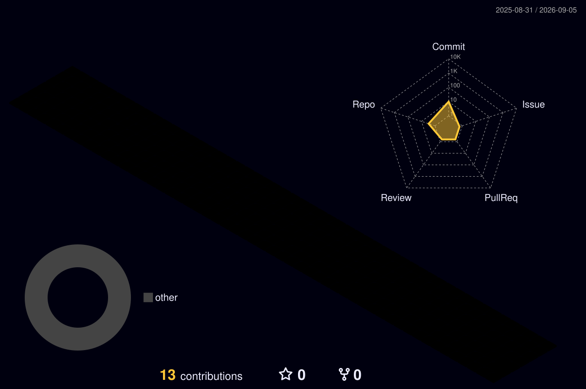

<!-- ===================== HERO ===================== -->

<div align="center">


<br>


</div>

<br>

<!-- ===================== PROFILE ===================== -->

<h2 align="center">⚡ Developer Profile</h2>

<table>
<tr>

<td width="50%" valign="top">

<h3 align="center">👨‍💻 Backend Engineering</h3>

<p align="center">

☕ <b>Java Backend Developer</b><br><br>

🍃 Spring Boot & REST APIs<br><br>

🏗️ Microservices Architecture<br><br>

🧠 Clean Code & Maintainability<br><br>

⚡ Performance & Scalability

</p>

</td>

<td width="50%" valign="top">

<h3 align="center">🚀 Current Focus</h3>

<p align="center">

☁️ Microsoft Azure<br><br>

🐳 Docker & Containers<br><br>

🔄 CI/CD & Automation<br><br>

🗄️ SQL Databases<br><br>

🌐 Distributed Systems

</p>

</td>

</tr>
</table>

<br>

<!-- ===================== ARSENAL ===================== -->

<h2 align="center">⚙️ Technology Arsenal</h2>

<div align="center">

<h3>💻 Languages</h3>


<br><br>

<h3>🔥 Backend & Frameworks</h3>


<br><br>

<h3>☁️ Cloud & DevOps</h3>


<br><br>

<h3>🗄️ Databases</h3>


<br><br>


<br><br>

<h3>🛠️ Development Tools</h3>


</div>

<br><br>

<!-- ===================== METRICS ===================== -->

<h2 align="center">📡 Developer Command Center</h2>

<p align="center">
<b>Development activity • repositories • languages • contribution analytics</b>
</p>

<p align="center">


</p>

<br>

<!-- ===================== 3D ===================== -->

<h2 align="center">🌌 Contribution Universe</h2>

<p align="center">



</p>

<br>

<!-- ===================== SNAKE ===================== -->

<h2 align="center">🐍 Contribution Engine</h2>

<p align="center">

<picture>

<source
media="(prefers-color-scheme: dark)"
srcset="./assets/github-snake-dark.svg"
/>

<source
media="(prefers-color-scheme: light)"
srcset="./assets/github-snake.svg"
/>


</picture>

</p>

<br>

<!-- ===================== MINDSET ===================== -->

<h2 align="center">🧠 Engineering Mindset</h2>

<p align="center">


</p>

<br>

<!-- ===================== CODE ===================== -->

<h2 align="center">☕ Developer.java</h2>

```java
public final class Developer {

    private final String name = "Adolfo Berrocal";
    private final String role = "Backend Developer";

    private final String[] stack = {
        "Java",
        "Spring Boot",
        "Microservices",
        "Azure",
        "Docker",
        "SQL"
    };

    public void build() {
        learn();
        design();
        code();
        test();
        deploy();
        improve();
    }

    public String mission() {
        return "Build reliable, scalable and maintainable software.";
    }
}
