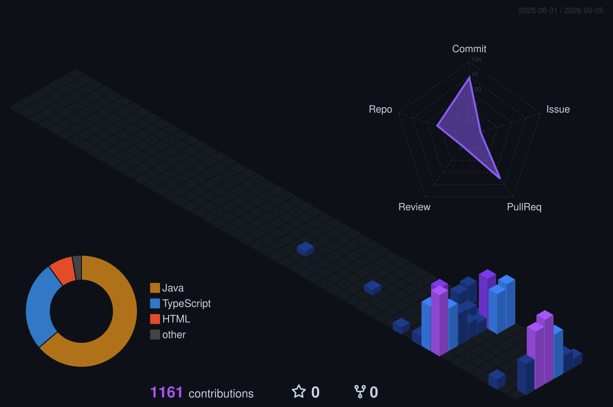

<!-- ╔══════════════════════════════════════════════════════════════╗
     ║   ADOLFO BERROCAL · GitHub Profile · palette blue → purple   ║
     ╚══════════════════════════════════════════════════════════════╝ -->

<div align="center">


<a href="https://github.com/manuel15963">

</a>

<br><br>


</div>

<br>

<!-- ═══════════════════════════ ABOUT ═══════════════════════════ -->

<h2 align="center">⚡ Developer Profile</h2>

<table align="center" width="100%">
<tr>
<td width="50%" valign="top">
<h3 align="center">☕ Backend Engineering</h3>
<p align="center">
Java 8 · 11 · 17 with <b>Spring Boot</b><br><br>
Reactive architecture with <b>WebFlux</b><br><br>
REST APIs · DTOs · JDBC · OpenAPI<br><br>
<b>Keycloak</b> SSO · role-based auth<br><br>
JUnit · Mockito · JMeter testing
</p>
</td>
<td width="50%" valign="top">
<h3 align="center">🚀 Cloud &amp; DevOps</h3>
<p align="center">
<b>Docker</b> &amp; <b>Kubernetes</b> (GKE / AKS)<br><br>
<b>Terraform</b> IaC on GCP &amp; Azure<br><br>
Pipelines: Jenkins · GitLab CI · Azure DevOps<br><br>
<b>Kafka</b> messaging · API Gateway<br><br>
DataDog · Prometheus · Grafana · SonarQube
</p>
</td>
</tr>
</table>

<br>

<!-- ═══════════════════════════ EXPERIENCE ═══════════════════════════ -->

<h2 align="center">💼 Professional Experience</h2>

<table align="center" width="100%">
<tr>
<td width="26%" valign="top" align="center">
<br>
<b>Novatec Solutions</b><br>
<sub>Client: BBVA Colombia</sub>
</td>
<td valign="top">
<b>Backend Java Developer · ASO / APX</b><br>
Banking backend components in Java 11 under BBVA corporate standards. Reusable
libraries for connection and data access, database connectivity through the TITAN
framework, and remittance-flow analysis across logs, traces and SQL validations.
</td>
</tr>
<tr>
<td width="26%" valign="top" align="center">
<br>
<b>BBVA</b><br>
<sub>APX / LRBA</sub>
</td>
<td valign="top">
<b>Backend Developer · Transactional &amp; Batch</b><br>
Online and batch components on the APX and LRBA-Batch platforms. Refactoring of
shared DTOs and libraries, working alongside solution architects. Change traceability
secured with automated tests and GitLab version control.
</td>
</tr>
<tr>
<td width="26%" valign="top" align="center">
<br>
<b>SOA-Cañete</b><br>
<sub>Cloud · DevOps · QA</sub>
</td>
<td valign="top">
<b>DevOps &amp; QA Automation Engineer</b><br>
Reactive microservices in Java 8/17 with Spring Boot and WebFlux. Multi-stage Jenkins
and GitLab CI pipelines with SonarQube gates to DEV/QA/PROD, AKS clusters provisioned
with Terraform, Kafka messaging, and monitoring dashboards on DataDog and Grafana.
</td>
</tr>
<tr>
<td width="26%" valign="top" align="center">
<br>
<b>I.E.S.T. Valle Grande</b><br>
<sub>Innovation project</sub>
</td>
<td valign="top">
<b>DevOps Assistant &amp; Full Stack Developer</b><br>
Automated development environment for a sales-management system. Dockerised stack,
GitHub Actions CI for unit tests, and Java EE / Spring Boot modules over Oracle and
SQL Server. Environment setup time cut by 60%.
</td>
</tr>
</table>

<p align="center">
🎓 <b>Técnico titulado en Análisis de Sistemas</b> · I.E.S.T. Privado Valle Grande · 2021 – 2023
</p>

<br>

<!-- ═══════════════════════════ FLAGSHIP ═══════════════════════════ -->

<h2 align="center">🏆 Personal Flagship · VENDINGCOM</h2>

<p align="center">
<b>Multi-tenant SaaS for vending-machine operators</b><br>
12 Spring Boot microservices · Angular + Ionic app · Google Cloud Run · Supabase (PostgreSQL)
</p>

<p align="center">


</p>

<p align="center">
<sub>Auth · Customers · Locations · Machines · Inventory · Routes &amp; Visits · Collections · Reports · Tickets · Supply · Purchases · Expenses</sub>
</p>

<br>

<!-- ═══════════════════════════ ARSENAL ═══════════════════════════ -->

<h2 align="center">⚙️ Technology Arsenal</h2>

<div align="center">

<h3>💻 Languages</h3>


<br><br>

<h3>🍃 Backend &amp; Frameworks</h3>

<br>


<br><br>

<h3>☁️ Cloud, DevOps &amp; IaC</h3>

<br>


<br><br>

<h3>📡 Messaging &amp; Observability</h3>

<br>


<br><br>

<h3>🗄️ Databases</h3>

<br>


<br><br>

<h3>🧪 Testing &amp; Tools</h3>

<br>


</div>

<br>

<!-- ═══════════════════════════ STATS ═══════════════════════════ -->

<h2 align="center">📊 GitHub Stats</h2>

<div align="center">




<br><br>


</div>

<br>

<!-- ═══════════════════════════ METRICS ═══════════════════════════ -->

<h2 align="center">📡 Developer Command Center</h2>

<p align="center">

</p>

<br>

<!-- ═══════════════════════════ SNAKE ═══════════════════════════ -->

<h2 align="center">🐍 Contribution Snake</h2>

<p align="center">
<picture>
<source media="(prefers-color-scheme: dark)" srcset="./assets/github-snake-dark.svg"/>
<source media="(prefers-color-scheme: light)" srcset="./assets/github-snake.svg"/>

</picture>
</p>

<br>

<!-- ═══════════════════════════ 3D ═══════════════════════════ -->

<h2 align="center">🌌 Contribution Universe</h2>

<p align="center">

</p>

<br>

<!-- ═══════════════════════════ MINDSET ═══════════════════════════ -->

<h2 align="center">🧠 Engineering Mindset</h2>

<p align="center">


</p>

<br>

<!-- ═══════════════════════════ CODE ═══════════════════════════ -->

<h2 align="center">☕ Developer.java</h2>

```java
@Service
public final class Developer {

    private final String name     = "Adolfo Berrocal";
    private final String role     = "Backend Java Developer";
    private final String location = "Lima, Perú 🇵🇪";

    private final String[] stack = {
        "Java 8 / 11 / 17", "Spring Boot", "WebFlux",
        "Microservices", "Kafka", "Keycloak",
        "Docker", "Kubernetes", "Terraform",
        "GCP", "Azure", "Jenkins", "GitLab CI",
        "PostgreSQL", "Oracle", "MongoDB"
    };

    public Mono<Software> build() {
        return analyze()
                .flatMap(this::design)
                .flatMap(this::code)
                .flatMap(this::test)
                .flatMap(this::deploy)
                .doOnNext(this::monitor)
                .repeat();   // never stop improving
    }

    public String mission() {
        return "Build reliable, scalable and maintainable software.";
    }
}
```

<br>

<!-- ═══════════════════════════ FOOTER ═══════════════════════════ -->

<div align="center">


</div>
